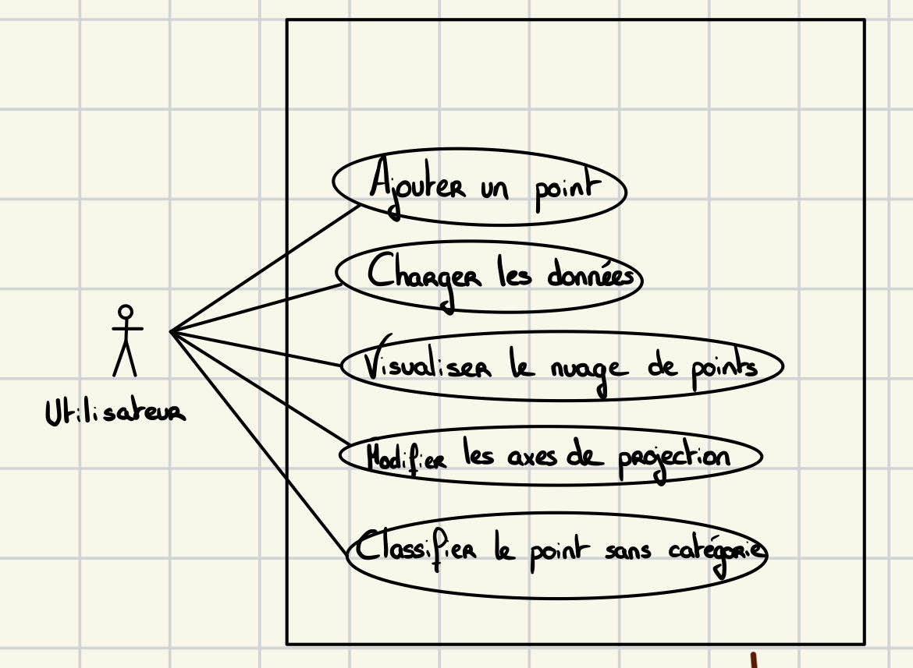
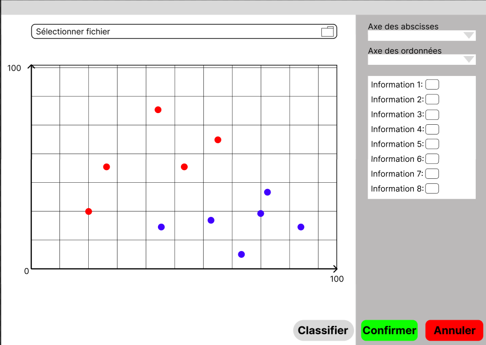
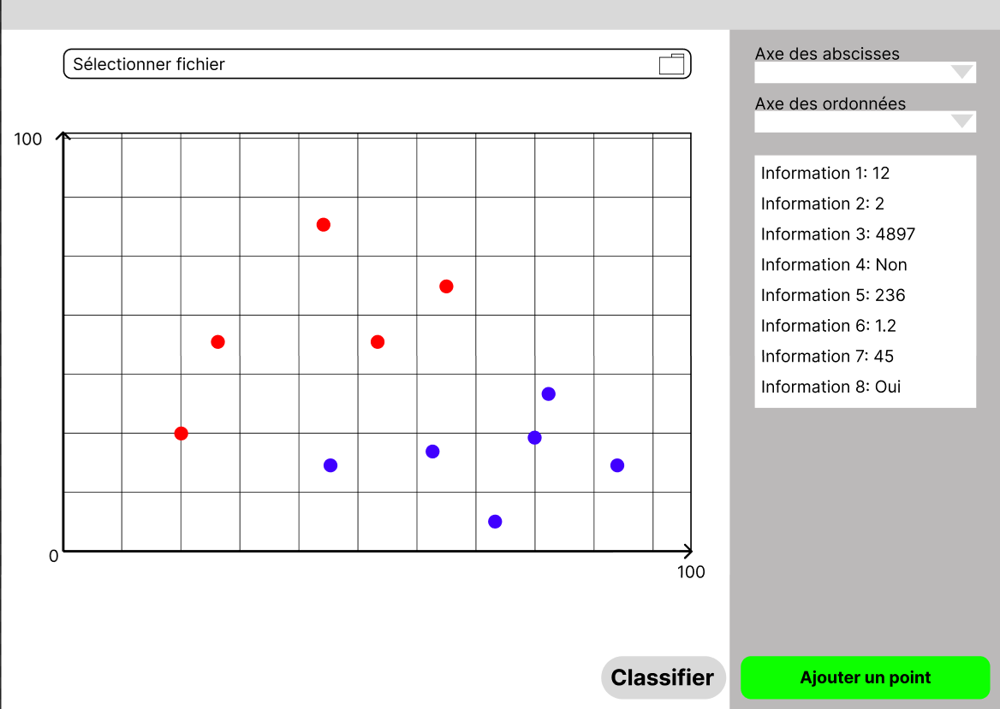
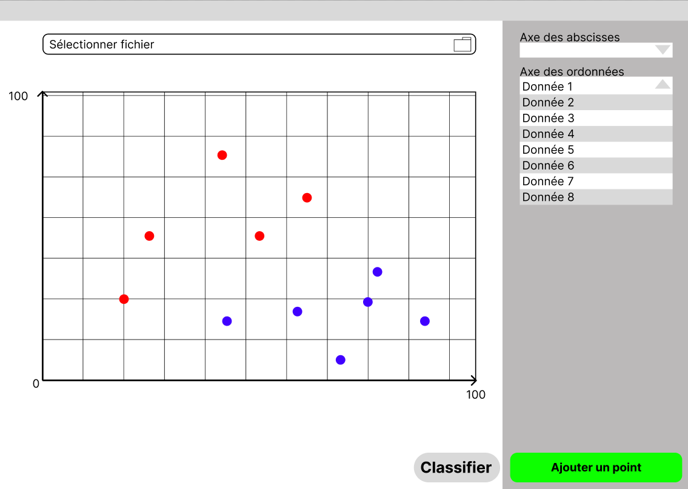

\centering

# SAE3.02 Dev. Application-Classification

\vspace{2cm}

#### Équipe J5
- **KOCHIEV Mickhail**
- **LECOCQ Dylan**
- **OKUBO Camille**
- **KHUDOEV Revaz**
- **UTZERI Giorgio**

\vfill
Université de Lille \\
BUT Informatique \\
Année 2024-2025

\newpage

\tableofcontents

\newpage
 
## Organisation du travail

### Contributions des membres de l'équipe

- **KOCHIEV Mickhail**  
Rédaction de la fiche descriptive pour l'UC "Charger une donnée" et ajout de cette fiche au dépôt Git.  
Participation à la conception des interfaces utilisateur liées au chargement des données.  
Contribution à la conception du diagramme de cas d'utilisation en identifiant les principales interactions utilisateurs.  

- **LECOCQ Dylan**  
Rédaction de la fiche descriptive pour l'UC "Ajouter une donnée".  
Planification et organisation des tâches de l'équipe, en suivant l'avancement des contributions de chacun.  
Contribution à la conception du diagramme de cas d'utilisation en identifiant les principales interactions utilisateurs.  

- **OKUBO Camille**  
Création des prototypes d'interfaces sur figma et prise en compte des ajouts de l'ensemble de l'équipe.  
Contribution à la conception du diagramme de cas d'utilisation en identifiant les principales interactions utilisateurs.  

- **KHUDOEV Revaz**  
Participation à la rédaction de la fiche descriptive pour l'UC "Classifier une donnée non classifiée".  
Contribution à la conception du diagramme de cas d'utilisation en identifiant les principales interactions utilisateurs.  

- **UTZERI Giorgio**  
Redaction de l'ensemble du rapport d'analyse en faisant le lien avec toutes les informations de l'équipe et les modifications.  
Aide sur l'ensemble des membres pour permettre le lien entre toutes les interfaces prototypes.  
Contribution à la conception du diagramme de cas d'utilisation en identifiant les principales interactions utilisateurs.  

- **Ensemble de l'équipe**  
Travail collaboratif sur la conception de l'architecture fonctionnelle de l'application.
Discussions et choix des outils de versioning et de gestion de projet (par exemple, mise en place du dépôt Git).  
Mise en place sur powerAMC de l'ensemble du diagramme de classes par rapport à toutes les tâches effectuées par chaques membres de l'équipe pour répondre aux besoins du client.  
\newpage

## Diagramme de cas d'utilisation


Ce diagramme a été réaliser pour le premier jalon. Ainsi nous avons uniquement un utilisateur.  
Cet utilisateur peut alors réaliser plusieurs tâches comme :  
ajouter un point,   
charger les données,   
visualiser le nuage de points,  
modifier les axes de projection,  
classifier le point sans catégorie.  

\newpage

## Fiches descriptives

### Fonctionnalités Décrites

- **Charger l'ensemble des données**
```plaintext
Système : Application - Classification
Cas d'utilisation : Charger les données

Acteur principal : Utilisateur
Acteur secondaire : Aucun
Garanties en cas de succès : L'application charge le fichier sans problèmes
Garanties minimales : L'application ne charge pas de fichier incompatible

Scénario nominal :
1. L'utilisateur sélectionne "Charger un fichier"
2. L'explorateur de fichiers se lance
3. L'utilisateur sélectionne le fichier recherché
4. Le système charge le fichier et affiche la possibilité de choisir les axes de projection
5. L'utilisateur informe les axes de projection
6. Le système ffiche la visualisation des données

Scénario alternatif :
3(A) : L'utilisateur sélectionne un fichier incompatible
4(A) : Le système informe l'utilisateur que le fichier est incompatible et revient à l'étape d'avant.  
```
- **Ajouter une donnée**
```plaintext
Système: Système de classification de données
Cas d'utilisation: Ajouter une donnée

Acteur principal: Utilisateur
Déclencheur: aucun
Préconditions: aucune 

Garanties en cas de succès: La donnée est enregistrée à part des données chargées.
Garanties minimales: Si le scénario n'aboutit pas, l'état du système reste inchangé.

Scénario nominal: 

1. L'utilisateur sélectionne la fonctionnalité "Ajouter une donnée"
2. Le système affiche un formulaire contenant l'ensemble des champs caractérisant la donnée ainsi que des boutons annuler et valider.
3. L'utilisateur saisit les informations puis valide.
4. Le système enregistre cette donnée.

Scénarios alternatifs: 

A: Annulation: Dans l'étape 3, l'utilisateur annule la saisie.
    3A. L'utilisateur sélectionne le bouton annuler.
    4A. Le système n'enregistre pas les données et ferme la fenêtre contenant le formulaire.
```

- **Classifier la donnée non classifiée**
```plaintext
Systeme: Application-Classification
Cas d'utilisation: Classifier le point sans catégorie

Acteur principal: Utilisateur
Déclencheur: Aucun
Précondition: Il y a au moins un point sans catégorie

Garantie en cas de succès: le aura une catégorie
Garantie minimale: l'etat du systeme reste inchangé

Scénario nominal:

1. L'utilisateur sélectionne la fonctionnalité "Classifier"
2. Le système détermine une catégorie en fonction des données du point et change la catégorie de celui-ci, pour chaque point sans catégorie.
```

\newpage

## Prototypes pour l'interface

### Ajouter une donnée

Ecran pour étape 2 de la fiche descriptive du UC Ajouter une donnée.

### Classifier une donnée non classifiée

Ecran pour étape 1 de la fiche descriptive du UC Classifier un point.

### Modifier les attributs pour l'affichage

Ecran pour étape 5 de la fiche descriptive du UC charger les données.

\newpage

## Diagramme de classes

