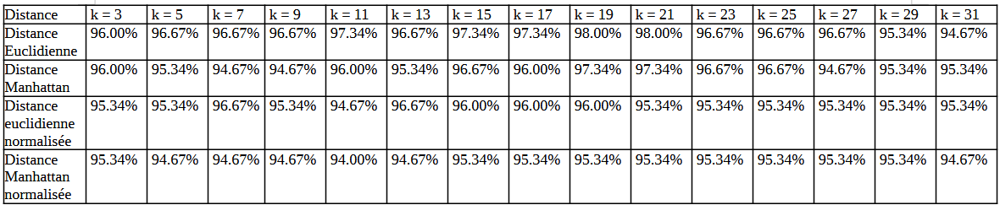

# Rendu de développement efficace SAE3.02 Dev

## **Équipe J5**

- KOCHIEV Mickhail
- LECOCQ Dylan
- OKUBO Camille
- KHUDOEV Revaz
- UTZERI Giorgio

\newpage

## **Description des éléments attendus**

### **Implémentation de k-NN**

#### Introduction

L’algorithme k-NN (k plus proches voisins) sert à classer un point en fonction des points les plus proches de lui dans un ensemble de données. Pour cela, on calcule les distances entre le point à classer et tous les autres points, puis on regarde quels voisins sont les plus proches. Avec cet algorithme, on peut déterminer à quelle catégorie appartient un point.
Dans ce projet nous avons alors décidé d'implementer des méthodes pour chaque étape : calcul des distances, recherche des voisins et attribution d’une catégorie.

#### Classes et Méthodes

L'ensemble des méthodes permettant le fonctionnement de l'algorithme se trouve dans la classe "KNNClassifier.java" avec les méthodes principales suivantes :

- La méthode "kPlusProchesVoisins" récupère les k points les plus proches d’un point donné. On calcule les distances avec une méthode fournie (Manhattan ou Euclidienne), et on garde les k plus petites.
- La méthode "determinerCategorie" utilise les k voisins pour voir à quelle catégorie appartient la majorité d’entre eux. On ajoutera alors cette catégorie au point.
- La méthode classify applique tout ce processus sur un point pour le classer directement.

Pour calculer les distances, nous avons créé une interface Distance. Elle définit une méthode distance(p1, p2) qui est implémentée de plusieurs façons :
- Distance Euclidienne : La distance géométrique.
- Distance Manhattan : La somme des écarts absolus sur chaque dimension.
- Distances normalisées : Les versions Euclidienne et Manhattan mais où les valeurs sont ajustées pour éviter qu’un attribut domine les autres.

#### Normalisation 

La normalisation, c’est rendre les données comparables en ajustant leurs échelles.
On utilise alors une formule simple pour tout ramener entre 0 et 1 :

Valeur = (Valeur - Min) / (Max - Min)

Les valeurs minimales et maximales sont calculées quand les données sont chargées. Ensuite, elles sont utilisées automatiquement dans les calculs normalisés.

#### Robustesse

Pour évaluer si notre algorithme fonctionne bien, on utilise une validation croisée. Nous testons alors notre algorithme sur des données qu’il n’a jamais vues avant. Ensuite, on mesure le pourcentage de points correctement classés.

#### Efficacité

Pour savoir si notre programme est efficace c'est verifié que le temps que notre algorithme met à tourner et la façon dont on organise les données sont bien.
Pour calculer les distances, on utilise une HashMap qui associe chaque distance calculée à un point.
On calcule alors chaque distance une seule fois et elles sont triées à mesure qu'on les calcule cela est alors optimisé.

### **Validation croisée**

#### Explication 

La validation croisée est une méthode pour tester si notre algorithme est fiable. 
Plutôt que de juste entraîner le modèle sur toutes les données et espérer qu’il marche bien, 
on le teste sur des données qu’il n’a pas vues avant. Cela permet d’évaluer si notre algorithme 
est capable de bien classer des données inconnues, ce qui est essentiel pour un bon modèle.

#### Méthode utilisée

Voici comment nous avons mis en place la validation croisée pour notre projet :
On divise les données disponibles en deux parties :
- Ensemble d’entraînement : Ce sont les données sur lesquelles le modèle apprend.
- Ensemble de test : Ce sont les données sur lesquelles on vérifie si le modèle classe correctement.
On applique alors l’algorithme k-NN sur l’ensemble d’entraînement et on utilise les tests pour voir combien de points sont bien classés.
La formule pour calculer le pourcentage de réussite est la suivante :
% = (Nombre de points bien classés)/(Nombre total de point testés)*100

### **Choix du meilleur k**

Meilleur k pour IrisPoint :

Meilleur k pour Pokemon :

\newpage

## **Efficacité**

### **Structures de données utilisées**

Dans l’implémentation de l’algorithme k-NN, nous avons chosis plusieurs structures de données pour leur simplicité et leur efficacité :

- Liste (List<IrisPoint>) :
  La liste contient les points de données sur lesquels on applique l’algorithme. Elle est facile à manipuler pour parcourir l’ensemble des données.
- Table de hachage (HashMap<Double, IrisPoint>) :
  Pendant la recherche des k plus proches voisins, les distances entre le point à classer et les autres points sont calculées et ajouté dans une table de hachage. Cette structure permet un accès rapide pour récupérer les points associés à leurs distances.

### **Justification**

Les structures que nous avons choisies sont adaptées pour notre algorithme k-NN car elles permettent d'optimiser certaines étapes :

Pour le calcul des distances une simple liste suffit pour stockers les points car l'algorithme parcourt tous les points pour calculer les distances.
Concernant le tri des distances on utilise une HashMap pour associer la distance à chaque point. Même si on doit ensuite trier les distances pour trouver les plus proches voisins cette approche est plus rapide pour nos données.
Si un point a des distances égales d'un autre, on peut gérer cela en ajoutant une logique supplémentaire. Nous aurions pu utiliser un TreeMap pour un tri automatique mais la HashMap est plus rapide sur nos cas qui sont simple.

### **Conclusion**

Nos choix de structures de données et d'algorithmes dans ce projet sont adaptés pour un bon équilibre entre le nombre d'opération et la rapidité d'exécution. Les list et les HashMap sont faciles à utiliser et performantes. 
